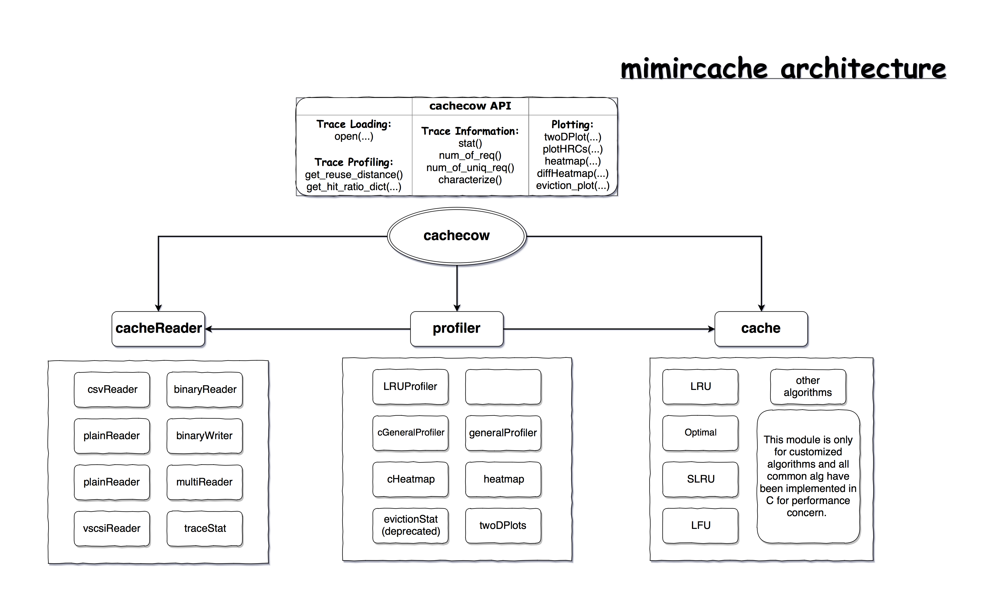

.. _API:

API
===
The architecture of mimircache is shown in the diagram below, it contains three parts, profiler, cache and cacheReader, which provides the detailed functions. cachecow is an upper level API that provides most common basic operations. To perform detailed operations, you will need to deal with the three components, so check the API below. 

.. toctree::
        :maxdepth: 3 

        API/cachecow 
        API/profiler
        API/profiler/LRUProfiler
        API/profiler/cGeneralProfiler
        API/profiler/twoDPlots
        API/profiler/cHeatmap 
        API/profiler/heatmap 
        API/profiler/generalProfiler 
        API/cache
        API/cacheReader 
