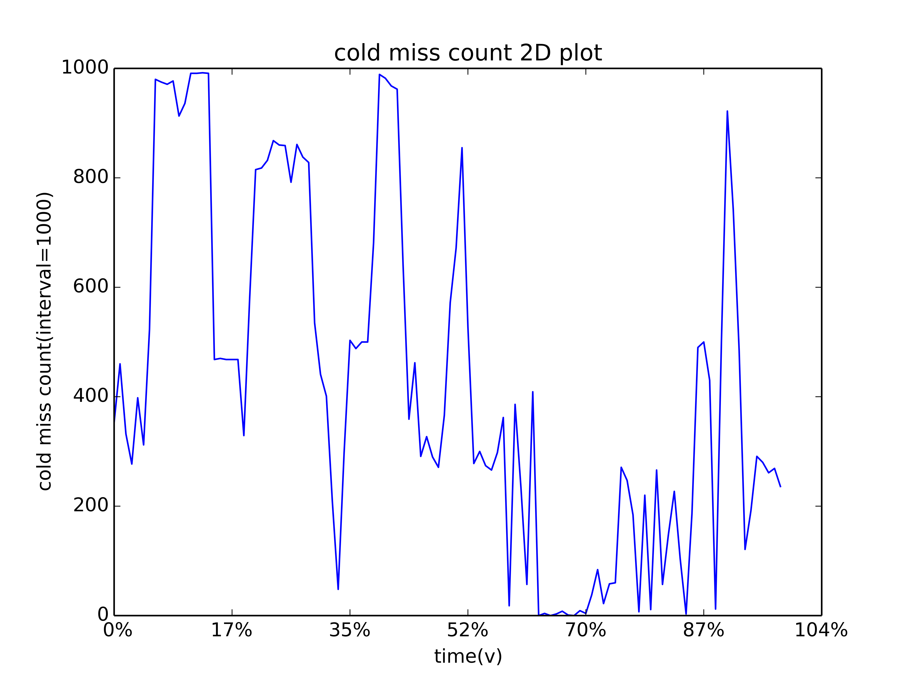
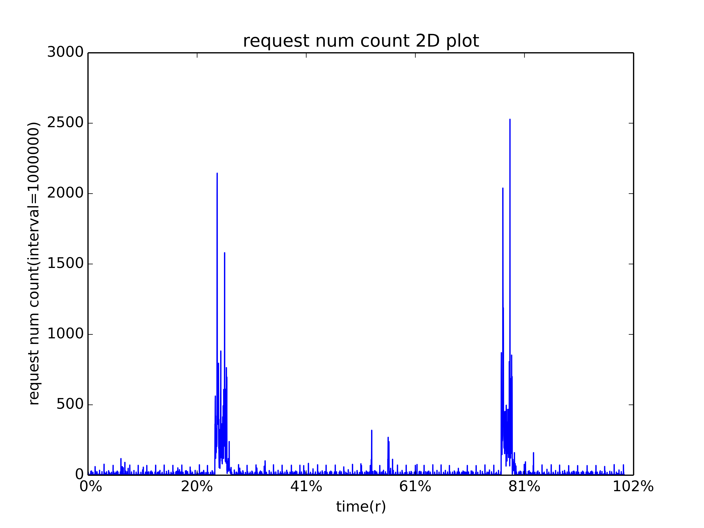
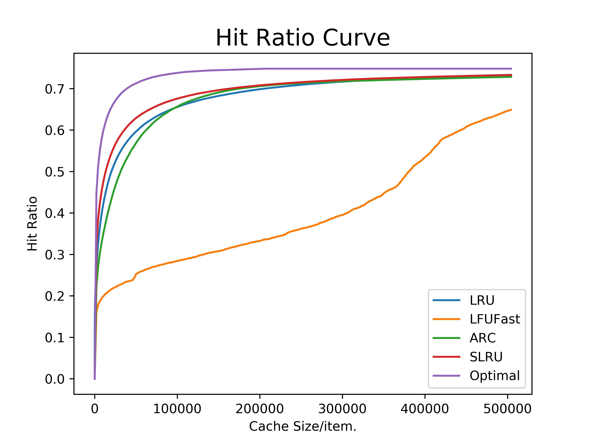

.. _basic_plotting:

Basic Plotting
==============

Basic Plotting
--------------
mimircache allows you to plot a variety graphs, including basic graphs to help you get better visualizing and understanding of your data.
Before plotting, let's talk about the concept of time, there are two types of time concept in mimircache.

The first one is called **virtual time**, which basically is the order in the request sequence, so the first request has virtual time 1, the second request has virtual time 2, etc.

The other is **real time**, which is the wall clock time and it is used only when you have specified the field/column of real_time in the data.

Current supported plot types are listed in the table below

+-----------------+--------------------------------------------------------------------------------------------------------------------------------------------------------------+
| plot type       | description                                                                                                                                                  |
+-----------------+--------------------------------------------------------------------------------------------------------------------------------------------------------------+
| cold_miss       | cold miss count VS time, how many cold miss every x seconds (real time and unit is the same as the unit in trace file) or every x requests (virtual time)    |
+-----------------+--------------------------------------------------------------------------------------------------------------------------------------------------------------+
| cold_miss_ratio | similar to cold miss plot, the difference is it shows the ratio of cold miss instead of count of cold miss                                                   |
+-----------------+--------------------------------------------------------------------------------------------------------------------------------------------------------------+
| request_num     | the number of requests per x seconds (real time and unit is the same as the unit in trace file), virtual time does not make sense here                       |
+-----------------+--------------------------------------------------------------------------------------------------------------------------------------------------------------+
| popularity      | the popularity curve of the obj in the trace, it shows how many objects have how many hits                                                                   |
+-----------------+--------------------------------------------------------------------------------------------------------------------------------------------------------------+
| mapping         | map from obj to a uniq id and plot the requests, this is used to identify scan in the requests                                                               |
+-----------------+--------------------------------------------------------------------------------------------------------------------------------------------------------------+
| rd_distribution | the reuse distribution 2d plot, it shows how many requests have reuse distance of X                                                                          |
+-----------------+--------------------------------------------------------------------------------------------------------------------------------------------------------------+

To plot these figures, you can invoke twoDPlot function on cachecow obj:

>>> c.twoDPlot(plot_type, **kwargs)

All optional kwargs all listed in the table below.

+-----------------+-----------------------------------+--------------------------------------------------------------------------------------------------------------+
| arguments       |  supported plot types             |        description                                                                                           |
+-----------------+-----------------------------------+--------------------------------------------------------------------------------------------------------------+
| mode            | cold_miss/request_num             |        time mode used in plotting, "v" for virtual time, "r" for real time.                                  |
|                 | cold_miss_ratio                   |                                                                                                              |
+-----------------+-----------------------------------+--------------------------------------------------------------------------------------------------------------+
| time_interval   | cold_miss/request_num             |        the time interval/span of each sample.                                                                |
|                 | cold_miss_ratio                   |                                                                                                              |
+-----------------+-----------------------------------+--------------------------------------------------------------------------------------------------------------+
| logX            | popularity/rd_distribution        |        whether we use log scale X-axis                                                                       |
+-----------------+-----------------------------------+--------------------------------------------------------------------------------------------------------------+
| logY            | popularity/rd_distribution        |        whether we use log scale Y-axis                                                                       |
+-----------------+-----------------------------------+--------------------------------------------------------------------------------------------------------------+
| cdf             | popularity/rd_distribution        |        whether we want to plot CDF                                                                           |
+-----------------+-----------------------------------+--------------------------------------------------------------------------------------------------------------+
| partial_ratio   | mapping                           |        the zoom in ratio, if it is 1, then no zoom in, see below for further explanation.                    |
+-----------------+-----------------------------------+--------------------------------------------------------------------------------------------------------------+
| figname         | all plots                         |        the name of the figure                                                                                |
+-----------------+-----------------------------------+--------------------------------------------------------------------------------------------------------------+

Cold miss plot
^^^^^^^^^^^^^^

* Cold miss plot: the count of cold misses in the given interval.

>>> c.twoDPlot('cold_miss', mode="v", time_interval=1000)   # the number of cold misses every 1000 requests

        Cold miss count in virtual time

Request number plot
^^^^^^^^^^^^^^^^^^^

* Request number plot: the number of requests in the given interval.

>>> c.twoDPlot('request_num', mode="r", time_interval=10000)   # the number of requests every 10000 seconds

        Request number count in real time

Mapping plot
^^^^^^^^^^^^
* Mapping plot: it renames each obj with sequence 1~N, then plot the time of each request.

* a pixel (X, Y) in the figure means obj Y is requested at virtual time X, a horizontal line y=Y plots the all the requests of a single obj Y.

* The default setting will plot two figures, the first figure plots all the requests with sampling, the second figure takes first partial_ratio (0.1) of all requests and do the same plotting, which can been thought as a zoom in for the first 10% of the trace.

* This plot is very useful when you are dealing with block level trace, we can see the scan very easily even if the scan if not scanning consecutive blocks.

>>> c.twoDPlot('mapping', partial_ratio=0.1)     # mapping plot

.. figure:: ../images/example_mappingplot.png
        :width: 50%
        :align: center
        :alt: example mapping plot
        :figclass: align-center

        Mapping plot

--------------

Hit Ratio Curve Plotting
------------------------

To plot hit ratio curve(HRC), you can either get a profiler and plot like the ones shown in :ref:`profiling<profiling>`, or you can use cachecow to directly plot hit ratio curves.

Using cachecow to plot HRC is easy, you just call plotHRC and pass in a list of algorithms you want to plot with:

>>> c.plotHRCs(algorithm_list, cache_params=None, cache_size=-1, bin_size=-1,
                auto_size=True, num_of_threads=4, use_general_profiler=False,
                save_gradually=False, figname="HRC.png", **kwargs)

A detailed explanation of each arguments can be found in the table below:

+-----------------------------+-----------------------------------+------------------------------------------------------------------------------------------------------------------------------------------------------------------------------------------------------+
| arguments                   |  Value type or possile value      |        description                                                                                                                                                                                   |
+-----------------------------+-----------------------------------+------------------------------------------------------------------------------------------------------------------------------------------------------------------------------------------------------+
| algorithm_list              | a list of algorithm               |        All supported algorithms can be found :ref:`here<algorithms>`.                                                                                                                                |
+-----------------------------+-----------------------------------+------------------------------------------------------------------------------------------------------------------------------------------------------------------------------------------------------+
| cache_params                | a list of cache alg parameters    |        It is a list of the same size of algorithm_list, use `None` if an algorithm does not require parameters.                                                                                      |
|                             |                                   |        If the list is all `None`, then cache_params is optional.                                                                                                                                     |
+-----------------------------+-----------------------------------+------------------------------------------------------------------------------------------------------------------------------------------------------------------------------------------------------+
| cache_size                  | int                               |        The max size of cache, if -1, then cachecow will find the largest one for you automatically.                                                                                                  |
+-----------------------------+-----------------------------------+------------------------------------------------------------------------------------------------------------------------------------------------------------------------------------------------------+
| bin_size                    | int                               |        cachecow will profiling at bin_size, bin_size*2 ... cache_size, if bin_size=-1, cachecow will use cache_size//100 as default.                                                                 |
+-----------------------------+-----------------------------------+------------------------------------------------------------------------------------------------------------------------------------------------------------------------------------------------------+
| auto_size                   | True/False                        |        Whether cachecow should chnage cache_size to avoid plateau at the end of HRC curve.                                                                                                           |
+-----------------------------+-----------------------------------+------------------------------------------------------------------------------------------------------------------------------------------------------------------------------------------------------+
| num_of_threads              | int                               |        Control concurrency in the application, default is 4.                                                                                                                                         |
+-----------------------------+-----------------------------------+------------------------------------------------------------------------------------------------------------------------------------------------------------------------------------------------------+
| use_general_profiler        | True/False                        |  Only Used for LRU profiling, the default profiler is LRUProfiler, which gives high accuracy, but has time complexity of O(NlogN), which can be time consuming on big data,                          |
|                             |                                   |  if use_general_profiler=True, then cachecow will use a generalProfiler for LRU as well, which has time complexity of O(N).                                                                          |
+-----------------------------+-----------------------------------+------------------------------------------------------------------------------------------------------------------------------------------------------------------------------------------------------+
| save_gradually              | True/False                        |        On big data, the hit ratio curve plotting can be very time consuming, save_gradually will save the plot everytime when one algorithm is finished.                                             |
+-----------------------------+-----------------------------------+------------------------------------------------------------------------------------------------------------------------------------------------------------------------------------------------------+
| figname                     | string                            |        The name of the figure, filename should contain suffix                                                                                                                                        |
+-----------------------------+-----------------------------------+------------------------------------------------------------------------------------------------------------------------------------------------------------------------------------------------------+

Example
^^^^^^^

>>> c.plotHRCs(["LRU", "LFUFast", "ARC", "SLRU", "Optimal"],
            cache_params=[None, None, None, {"N":2}, None],
            save_gradually=True)

        Hit Ratio Curves