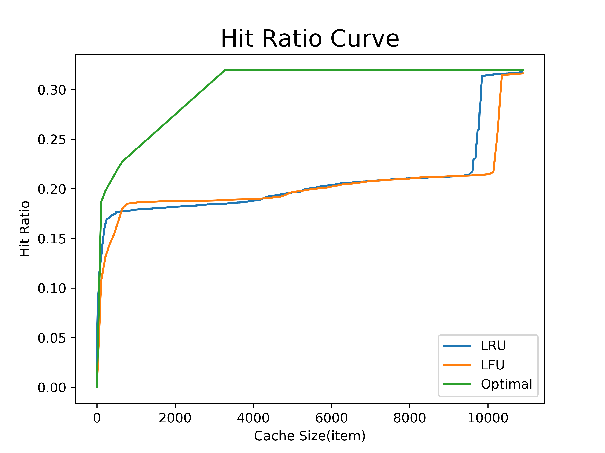

PyMimircache: a Python3 cache analysis platform
===============================================

Release v\ |version|.

Welcome to the documentation of PyMimircache, a Python3 cache analysis platform.
The target users of PyMimircache are **researchers** and **system administrators**. The goal behind PyMimircache is to provide a platform that

- allows **researchers** to study and design cache replacement algorithms easily and efficiently.
- allows **system administrators** to analyze and visualize their cache performance easily and efficiently.

**The power of PyMimircache**:

.. image::  User/images/github_heatmap.png
    :width: 48%

An example of hit ratio curve plot and hit ratio heatmap.

    >>> from PyMimircache import Cachecow
    >>> c = Cachecow()
    >>> c.vscsi("trace.vscsi")      # this file is in the data folder on GitHub, other data types also supported
    >>> print(c.stat())
    >>> print(c.get_reuse_distance())
    [-1 -1 -1 -1 -1 -1 11 7 11 8 8 8 -1 8]

    >>> print(c.get_hit_ratio_dict("LRU", cache_size=20))
    {0: 0.0, 1: 0.025256428270338627, 2: 0.031684698608964453, ... 20: 0.07794716875087819}

    >>> c.plotHRCs(["LRU", "LFU", "Optimal"])

    >>> c.heatmap('r', "hit_ratio_start_time_end_time", time_interval=10000000)

The User Guide
--------------
.. toctree::
        :maxdepth: 2

        User/intro
        User/installation
        User/quick_start
        User/Tutorial/open_trace
        User/Tutorial/profiling
        User/Tutorial/basic_plotting
        User/Tutorial/heatmap_plotting
        User/Appendix/algorithms
        User/AdvancedUsage/advanced_usage
        User/API

Supported Features
------------------
* Cache replacement algorithms simulation.
* trace visualization.
* A variety of cache replacement algorithms, including LRU, LFU, MRU, FIFO, Clock, Random, ARC, SLRU, Optimal and etc.
* Hit/miss ratio curve (HRC/MRC) plotting.
* Efficient reuse distance calculation for LRU.
* Heatmap plotting for visualizing cache dynamics.
* Reuse distance distribution plotting.
* Cache replacement algorithm comparison.

Customization
-------------
Now you can customize PyMimircache to fit your own need. You can write

* your own cache reader for reading your special cache trace files.
* your own cache replacement algorithms.
* a middleware for sampling your cache traces for analysis.

Indices and tables
==================

* :ref:`search`

.. |br| raw:: html

    